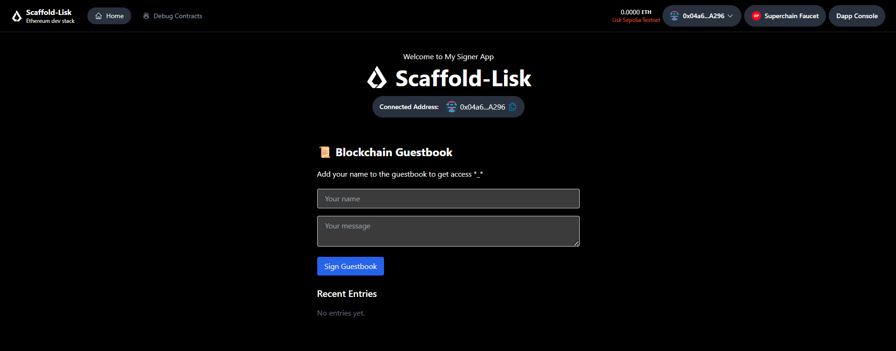

# Scaffold Lisk Guestbook DApp
This repository is my implementation of the Scaffold Lisk guided project assignment, where it was forked and customized the Scaffold Lisk template to deploy and interact with a smart contract on the Lisk blockchain.

## Project Overview
- The goal of this assignment was to:

- Fork the Scaffold Lisk project

- Create a branch for development

- Switch the project to use the Scaffold Lisk template

- Develop and deploy a smart contract on the Lisk chain

- Use the automatically generated ABI to interact with the contract

- Build a frontend that reads and writes data to the deployed contract

- Host the complete project on Vercel or Netlify

## My Solution
### Smart Contract
I wrote a simple Guestbook smart contract in Solidity that allows users to sign the guestbook by submitting their names and a messages. The contract stores entries and allows retrieval of all guestbook entries and the total count.

Terminal / CLI Commands Used
1. Fork and Clone the Scaffold Lisk Repository
# Fork the repository on GitHub manually, then clone your fork locally
- example
git clone https://github.com/phertyameen/scaffold-lisk.git
cd scaffold-lisk

# Create and switch to a new branch for your work
git checkout -b my-guestbook-feature

2. Install Dependencies
yarn install

3. Configure Environment Variables
Create a .env file and add your RPC URL and private key:

## Example for Hardhat deployment
PRIVATE_KEY="your-wallet-private-key"
RPC_URL="https://rpc.sepolia-api.lisk.com"

4. Compile the Smart Contract
yarn hardhat compile

5. Deploy the Contract
yarn hardhat run scripts/deploy.ts --network sepolia
Make sure your hardhat.config.ts or hardhat.config.js includes the sepolia network configuration with the RPC_URL and PRIVATE_KEY.

6. Run the Frontend Locally
yarn dev
Visit http://localhost:3000 to interact with your deployed contract via the frontend.

9. Deploy to Vercel

### Frontend Integration
- Used Scaffold Lisk hooks to read and write contract data seamlessly.

- The frontend allows users to submit guestbook entries and displays all entries in real-time.

- The ABI was automatically handled by Scaffold Lisk.

### Hosting
The entire app is hosted live on Vercel: https://scaffold-lisk-nextjs-qmxk.vercel.app/
liskSepolia contract address: 0xdca98A8eC30f04Af51d695f8A3C6ADD86c86E92a

### Authur
- GitHub Repository: [@phertyameen](https://github.com/phertyameen/scaffold-lisk)
- LinkedIn - [Fatima Aminu](https://www.linkedin.com/in/fatima-aminu-839835176/)
- Farcaster - [@teemahbee](https://farcaster.xyz/teemahbee)

### Challenges Faced

- Insufficient funds error: On sending transactions, encountered errors due to the wallet having insufficient testnet funds to pay for gas fees.

- Network and RPC configuration: Needed to ensure the correct RPC endpoints and network IDs were set for Lisk Sepolia testnet, which required some trial and error.

- Contract interaction: Debugging the flow between frontend input and smart contract write calls took effort, especially handling async transactions and loading states.

- Despite these, you still get to see a demo 😁💃🏽

### Environment Setup
Remember to create a .env file for Hardhat configuration with your network keys and RPC URLs for deployment.

Thank you for reviewing my project! Feel free to reach out if you have any questions.